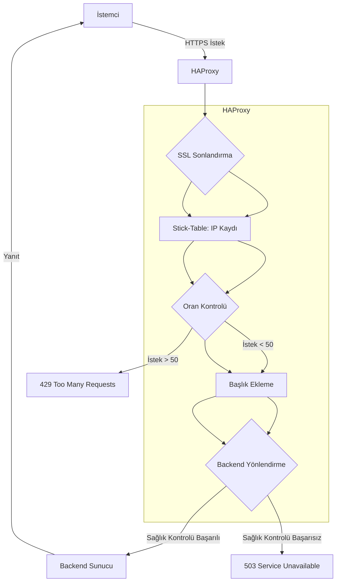

# 🛡️ HAProxy ile IP Bazlı Oran Sınırlama ve Yük Dengeleme

Bu proje, HAProxy’nin **stick-table** özelliği kullanılarak IP bazlı istek oranı sınırlama (rate limiting) ve HTTPS tabanlı yük dengeleme sağlayan yüksek performanslı bir yapılandırma sunar. İstemci davranışlarını izler, kötüye kullanımı tespit eder ve gerektiğinde engeller.

## 🚀 Özellikler

- **SSL/TLS Sonlandırma**: Çoklu sertifika yönetimi için `crt-list` ile HTTP/2 ve HTTP/1.1 desteği.
- **Stick-Table ile Oran Sınırlama**: IP başına istek oranı (`http_req_rate`) ve hata oranı (`http_err_rate`) takibi.
- **X-Forwarded Başlıkları**: Backend sunuculara istemci bilgisi aktarımı (IP, protokol, port, host).
- **Sağlık Kontrolleri**: Backend sunucuların durumunu periyodik `GET /health` istekleriyle kontrol etme.
- **Yönetim Paneli**: HAProxy istatistiklerini ve performans metriklerini izlemek için web arayüzü.
- **Özelleştirilmiş Hata Sayfaları**: HTTP durum kodları için kullanıcı dostu hata yanıtları.

## 📋 Gereksinimler

- **HAProxy**: 2.4 veya üstü (SSL, HTTP/2 ve stick-table desteği ile derlenmiş)
- **OpenSSL**: SSL sertifikaları için
- **Backend Sunucu**: WAF, web sunucusu veya başka bir HTTP tabanlı servis
- **Hata Sayfaları** (opsiyonel): `/etc/haproxy/errors/` dizininde özelleştirilmiş HTTP hata dosyaları
- **Sistem**: Linux tabanlı bir sunucu (Ubuntu/Debian önerilir)

## 🔧 Kurulum Adımları

1. **HAProxy Kurulumu**:
   ```bash
   sudo apt-get update
   sudo apt-get install haproxy
   ```

2. **Yapılandırma Dosyasını Kopyalama**:
   ```bash
   sudo cp haproxy.cfg /etc/haproxy/haproxy.cfg
   ```

3. **SSL Sertifikalarını Hazırlama**:
   - Sertifikaları `/etc/haproxy/certs/cluster.crtlist` yoluna yerleştirin.
   - Sertifika listesi formatı için [HAProxy dökümantasyonuna](https://www.haproxy.org/) bakın.

4. **Backend IP Adresini Güncelleme**:
   - `<SUNUCU_IP_ADRESİ>` değerini gerçek backend IP adresinizle değiştirin.

5. **Yapılandırmayı Test Etme**:
   ```bash
   haproxy -c -f /etc/haproxy/haproxy.cfg
   ```

6. **HAProxy’yi Başlatma**:
   ```bash
   sudo systemctl restart haproxy
   sudo systemctl enable haproxy
   ```

## 🛠️ Teknik Detaylar

### Stick-Table Mekanizması
`stick-table`, HAProxy’nin in-memory bir veri tablosudur ve istemci IP’lerine ait durum bilgilerini tutar. Bu yapılandırmada:

- **Tür**: `type ip` (IPv4 ve IPv6 desteği)
- **Boyut**: `size 1m` (1 milyon giriş kapasitesi)
- **Süre**: `expire 10m` (10 dakika sonra girişler temizlenir)
- **Depolanan Veriler**:
  - `gpc0`: Genel amaçlı sayaç (özel kullanımlar için)
  - `http_req_rate(10s)`: Son 10 saniyede yapılan HTTP istek sayısı
  - `http_err_rate(10s)`: Son 10 saniyede üretilen HTTP hata sayısı

**Çalışma Mantığı**:
1. `http-request track-sc0 src`: Her gelen isteğin kaynak IP’si stick-table’a kaydedilir.
2. `http_req_rate(0)`: İlgili IP’nin son 10 saniyede yaptığı istek sayısını kontrol eder.
3. `http-request deny deny_status 429 if { sc_http_req_rate(0) gt 50 }`: 10 saniyede 50’den fazla istek yapan IP’lere `429 Too Many Requests` yanıtı döner.
4. `http_err_rate(0)`: Hata oranı kontrolü için ek bir güvenlik katmanı sağlar (ör. 5’ten fazla hata için engelleme).

### Oran Sınırlama Süreci
- **İstek Takibi**: Her HTTP isteği, kaynak IP ile ilişkilendirilir ve `stick-table` içinde sayılır.
- **Eşik Kontrolü**: `sc_http_req_rate(0) gt 50` ifadesi, istek sayısının 50’yi aşıp aşmadığını kontrol eder.
- **Engelleme**: Eşik aşılırsa, istemciye `429` yanıtı döner. Bu, istemcinin isteklerini geçici olarak durdurur, böylece sunucu kaynakları korunur.
- **Hata Oranı Kontrolü**: `http_err_rate` ile anormal davranışlar (ör. hatalı istekler) tespit edilip engellenir.

### Performans Optimizasyonları
- **Buffer Boyutu**: `tune.bufsize 32768` ile büyük istek/gövde verileri için yeterli bellek ayrılır.
- **Maksimum Bağlantı**: `maxconn 10000` ile yüksek trafik kapasitesi desteklenir.
- **HTTP/2 Desteği**: `alpn h2,http/1.1` ile modern istemciler için HTTP/2 etkinleştirilir.
- **Yeniden Deneme**: `option redispatch` ve `retries 3` ile başarısız bağlantılar otomatik olarak yeniden yönlendirilir.

## 📊 Akış Diyagramı



## 📝 Önemli Notlar

- **Oran Sınırlamayı Etkinleştirme**:
  ```haproxy
  http-request deny deny_status 429 if { sc_http_req_rate(0) gt 50 }
  ```
  Üretim ortamında test sonrası yorum satırını kaldırın.

- **Sertifika Yönetimi**: Sertifikaların `/etc/haproxy/certs/` dizininde olduğundan ve `cluster.crtlist` dosyasının doğru formatta olduğundan emin olun.
- **Güvenlik**:
  - Yönetim paneli için güçlü bir şifre kullanın (`admin:securepassword` yerine kendi şifrenizi belirleyin).
  - Yönetim paneline yalnızca güvenilir ağlardan erişim sağlayın.
- **Hata Sayfaları**: Özelleştirilmiş hata sayfalarını `/etc/haproxy/errors/` dizinine ekleyin.
- **Test**: Yapılandırmayı üretim ortamına dağıtmadan önce doğrulayın:
  ```bash
  haproxy -c -f /etc/haproxy/haproxy.cfg
  ```

```

## 🌟 Katkıda Bulunma

- Önerileriniz veya katkılarınız için GitHub’da bir **issue** açabilir veya **pull request** gönderebilirsiniz.
- Türkçe topluluğa katkıda bulunmak için [GitHub reposu](#) oluşturabilirsiniz.

## 📜 Lisans

Bu proje MIT lisansı altında lisanslanmıştır. Daha fazla bilgi için `LICENSE` dosyasına bakın.
